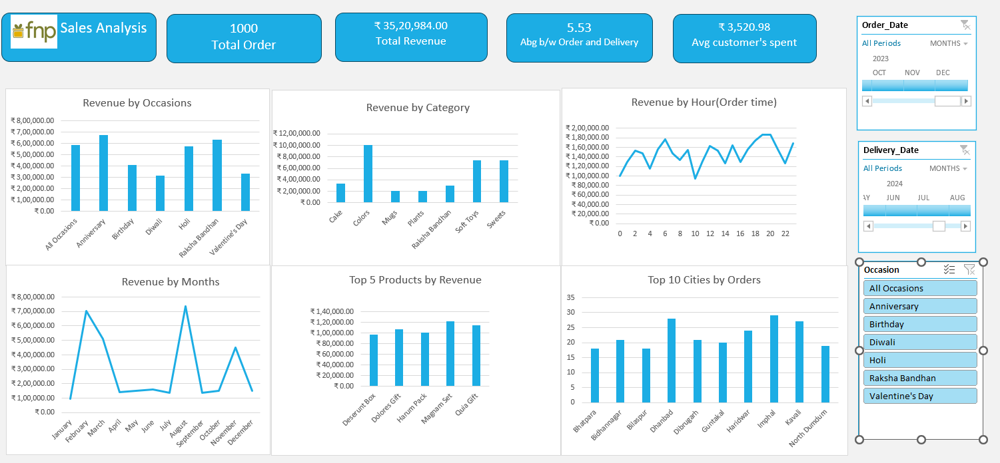

# 🌸 Ferns and Petals (FNP) — Sales Analysis Dashboard

> An end-to-end Excel data analytics project analyzing 1,000 gift orders across occasions like Diwali, Valentine's Day, Raksha Bandhan, and more — to uncover revenue trends, top products, and customer behavior.

---

## 📌 Overview

Ferns and Petals (FNP) is a gifting company that delivers products for major occasions across India. This project performs a full sales analysis using **Microsoft Excel** — from raw data cleaning and transformation to building an interactive dashboard — answering 10 key business questions to help the company improve its sales strategy and optimize customer satisfaction.

---

## 📂 Dataset

Three relational tables were used:

| File | Records | Key Columns |
|---|---|---|
| `orders.csv` | 1,000 | Order_ID, Customer_ID, Product_ID, Quantity, Order_Date, Delivery_Date, Occasion, Location |
| `customers.csv` | 204 | Customer_ID, Name, City, Gender, Email |
| `products.csv` | 70 | Product_ID, Product_Name, Category, Price (INR), Occasion |

**Occasions covered:** Anniversary · Birthday · Diwali · Holi · Raksha Bandhan · Valentine's Day

**Product Categories:** Cake · Colors · Mugs · Plants · Raksha Bandhan · Soft Toys · Sweets

---

## 🛠️ Tools Used

| Tool | Purpose |
|---|---|
| **Microsoft Excel** | Data cleaning, transformation, pivot tables, formulas, dashboard |
| **Power Query** | Data loading and merging across tables |
| **Pivot Tables & Charts** | Aggregations and visual analysis |
| **Excel Slicers** | Interactive dashboard filters |

---

## ❓ Business Questions Answered

| # | Question | Insight |
|---|---|---|
| 1 | Total Revenue | ₹35,20,984 across 1,000 orders |
| 2 | Avg. Order & Delivery Time | 5.53 days average between order and delivery |
| 3 | Monthly Sales Performance | February and September peak; June–July dip |
| 4 | Top 5 Products by Revenue | Deserunt Box, Dolores Gift, Harum Pack, Magnam Set, Quia Gift |
| 5 | Customer Spending Analysis | Average customer spend: ₹3,520.98 |
| 6 | Sales Performance by Top 5 Products | Tracked revenue contribution of top 5 items |
| 7 | Top 10 Cities by Orders | Kavali and Dhanbad lead with 28+ orders each |
| 8 | Order Quantity vs. Delivery Time | Analyzed whether higher quantities affect delivery speed |
| 9 | Revenue by Occasion | Anniversaries and Raksha Bandhan drive highest revenue |
| 10 | Product Popularity by Occasion | Identified best-selling products per occasion |

---

## 📊 Dashboard

The interactive Excel dashboard includes:

- **KPI Cards** — Total Orders · Total Revenue · Avg. Delivery Time · Avg. Customer Spend
- **Revenue by Occasion** — Bar chart comparing all occasions
- **Revenue by Category** — Category-level revenue breakdown
- **Revenue by Hour** — Line chart showing peak order times across the day
- **Revenue by Month** — Monthly trend line for 2023
- **Top 5 Products by Revenue** — Bar chart of best-performing products
- **Top 10 Cities by Orders** — City-level order volume chart
- **Interactive Slicers** — Filter by Order Date · Delivery Date · Occasion

### Dashboard Preview


---

## 📈 Key Results & Insights

- **Total Revenue** of ₹35.2 Lakhs generated from 1,000 orders in 2023
- **Anniversaries and Raksha Bandhan** are the highest revenue-generating occasions
- **February spikes** significantly — likely driven by Valentine's Day gifting
- **Evening hours (6 PM – 9 PM)** see the highest order volumes by hour
- **Kavali, Dhanbad, and Imphal** are among the top 10 cities by order count
- **Average delivery time of 5.53 days** — an area for potential logistics improvement
- **Average customer spend of ₹3,520.98** indicates a mid-to-premium gifting market

---

## 💡 Business Recommendations

1. **Stock up before February & September** — these months drive peak sales; inventory planning is critical
2. **Improve delivery time** — 5.53 days average is high for gifting; same-day or next-day options could boost satisfaction
3. **Promote during low months** — June and July see dips; targeted discounts could level out revenue
4. **Double down on top cities** — Kavali, Dhanbad, and Imphal show strong demand; localized campaigns can amplify this
5. **Bundle top products by occasion** — pair popular products with relevant occasions for upsell opportunities

---

## ▶️ How to Run

1. **Clone or download** this repository
   ```bash
   git clone https://github.com/your-username/fnp-sales-analysis.git
   ```

2. **Open the Excel file**
   ```
   Book1_AutoRecovered_.xlsx
   ```

3. **Enable editing** if prompted (required for slicers and pivot tables to work)

4. **Use the slicers** on the dashboard to filter by:
   - Order Date / Delivery Date
   - Occasion (Anniversary, Birthday, Diwali, etc.)

> ⚠️ Requires **Microsoft Excel 2016 or later** for full slicer and pivot chart compatibility.

---

## 📁 Project Structure

```
fnp-sales-analysis/
│
├── Book1_AutoRecovered_.xlsx        # Main Excel workbook with dashboard
├── Dashboard.png                    # Dashboard screenshot
├── orders.csv                       # Raw orders data (1,000 records)
├── customers.csv                    # Customer details (204 records)
├── products.csv                     # Product catalogue (70 items)
├── Ferns_and_Petals_Sales_Analysis.pdf  # Problem statement
└── README.md
```


*⭐ Star this repo if you found it useful!*
